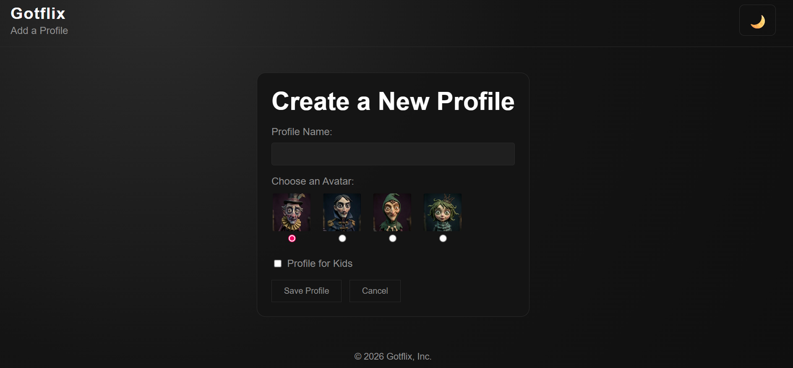
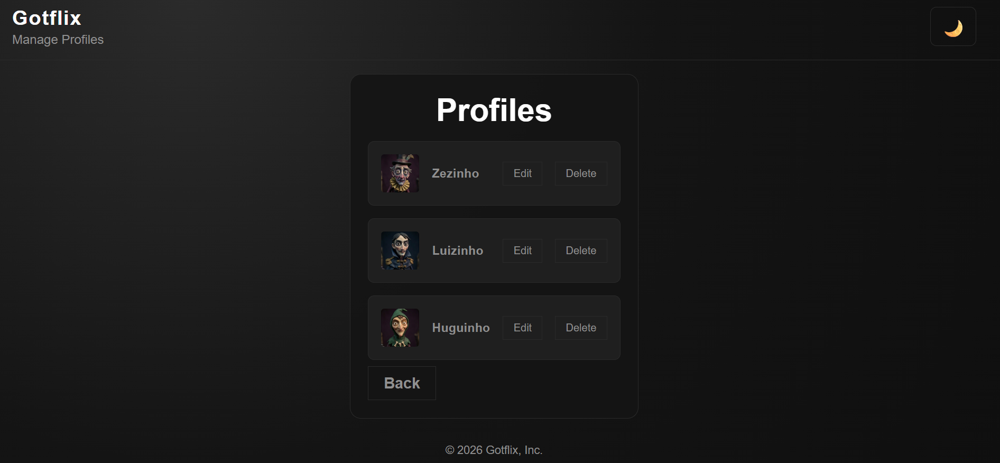

# 🎬 AI-Powered Web Project — Streaming Platform Inspired Interface

This project was developed as a real web application inspired by streaming platform interfaces such as Netflix. The main goal was to understand how web pages are built and take the first steps into front-end development with the support of Artificial Intelligence.

 

  
  
  

---

## 🚀 Technologies Used

- 🧠 Artificial Intelligence (AI) — used as a learning and development assistant
- 🌐 HTML5 — page structure
- 🎨 CSS3 — styling and responsive layout
- ⚙️ JavaScript — interactivity and dynamic behavior

---

## 📺 About the Project

This project simulates the interface of a streaming platform, focusing on:

- Home page with a movie and series catalog
- Modern and responsive layout
- Content organized into categories
- Visual experience inspired by real streaming services

The project was built to practice core web development concepts and understand how HTML, CSS, and JavaScript work together to create functional user interfaces.

---

## 🧠 What I Learned

During the development of this project, I was able to learn:

- How to structure web pages from scratch
- How to style modern interfaces using CSS
- How to add interactivity using JavaScript
- How to use AI as a learning and coding assistant
- How to replicate real-world interfaces for educational purposes

---

## 💡 Educational Purpose

This project has no commercial purpose. It was created purely for learning, practice, and skill development in:

- Front-End Development
- Programming logic
- UI/UX design fundamentals
- Use of Artificial Intelligence in the learning process

---

## 📌 Conclusion

Building this project helped me take my first steps in web development, turning ideas into a functional and visually inspired interface based on real-world platforms.

The combination of practice + technology + AI makes learning more accessible, interactive, and dynamic.

---
